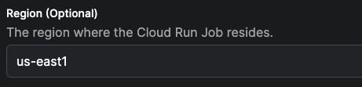

# Google Cloud Run Worker Guide

## Why use Google Cloud Run for Flow Run execution?
Google Cloud Run is a fully managed compute platform that automatically scales your containerized applications.

1. Serverless Architecture: Cloud Run follows a serverless architecture, which means you don't need to manage any underlying infrastructure. Google Cloud Run automatically handles the scaling and availability of your flow run infrastructure, allowing you to focus on developing and deploying your code.

2. Scalability: Cloud Run can automatically scale your pipeline to handle varying workloads and traffic. It can quickly respond to increased demand and scale back down during low activity periods, ensuring efficient resource utilization.

3. Integration with Google Cloud Services: Google Cloud Run easily integrates with other Google Cloud services, such as Google Cloud Storage, Google Cloud Pub/Sub, and Google Cloud Build. This enables you to build end-to-end data pipelines utilizing a variety of services.

4. Portability: Since Cloud Run uses container images, you can develop your pipelines locally using Docker and then deploy them on Google Cloud Run without significant modifications. This portability allows you to run the same pipeline in different environments.

## Google Cloud Run Guide
After completing this guide, you will have:

1. Created a Google Cloud Service Account
2. Created a Cloud Run Work Pool
3. Deployed a Cloud Run Worker
4. Deployed a Flow
5. Executed the Flow as a Google Cloud Run Job

If you're looking for a general introduction to workers, work pools, and deployments, check out the [workers and work pools tutorial](https://docs.prefect.io/latest/tutorial/workers/).

### Prerequisites
Before starting this guide, make sure you have:

- A [Google Cloud Platform (GCP) account](https://cloud.google.com/gcp?utm_source=google&utm_medium=cpc&utm_campaign=na-US-all-en-dr-bkws-all-all-trial-e-dr-1605212&utm_content=text-ad-none-any-DEV_c-CRE_665735450627-ADGP_Hybrid+%7C+BKWS+-+EXA+%7C+Txt_Google+Cloud-KWID_43700077223807301-kwd-26415313501&utm_term=KW_google+cloud+platform-ST_google+cloud+platform&gclid=Cj0KCQjw9MCnBhCYARIsAB1WQVWT-Le8HeBNmKVk7lvVV-SO7GGxQBQecIdKbtNc8mtFTtUKWWfy9HEaAnh4EALw_wcB&gclsrc=aw.ds&hl=en).
- A project on your GCP account where you have the necessary permissions to create Cloud Run Services and Service Accounts.
- The `gcloud` CLI installed on your local machine. You can follow Google Cloud's [installation guide](https://cloud.google.com/sdk/docs/install). If you're using Apple (or a Linux system) you can also use [Homebrew](https://formulae.brew.sh/cask/google-cloud-sdk) for installation.
- [Docker](https://www.docker.com/get-started/) installed on your local machine.
- A Prefect server instance. You can sign up for a forever free [Prefect Cloud Account](https://app.prefect.cloud/auth/login) or, alternatively, self-host a [Prefect server](https://docs.prefect.io/2.12.0/guides/host/).

### Step 1. Creating a Google Cloud Service Account
First, open a terminal or command prompt on your local machine where `gcloud` is installed. If you haven't already authenticated with `gcloud`, run the following command and follow the instructions to log in to your GCP account.

```bash
gcloud auth login
```

Next, you'll set your project where you'd like to create the service account. Use the following command and replace `[PROJECT_ID]` with your GCP project's ID.

```bash
gcloud config set project [PROJECT_ID]
```

For example, if your project's ID is `prefect-project` the command will look like this:

```bash
gcloud config set project prefect-project
```

Now you're ready to make the service account. To do so, you'll need to run this command:

```bash
gcloud iam service-accounts create [SERVICE_ACCOUNT_NAME] --display-name="[DISPLAY_NAME]"
```

Here's an example of the command above which you can use which already has the service account name and display name provided. An additional option to describe the service account has also been added:

```bash
gcloud iam service-accounts create prefect-service-account \
    --description="service account to use for the prefect worker" \
    --display-name="prefect-service-account"
```

The last step of this process is to make sure the service account has the proper permissions to execute flow runs as Cloud Run jobs.
Run the following commands to grant the necessary permissions:

```bash
gcloud projects add-iam-policy-binding [PROJECT_ID] \
    --member="serviceAccount:[SERVICE_ACCOUNT_NAME]@[PROJECT_ID].iam.gserviceaccount.com" \
    --role="roles/iam.serviceAccountUser"
```
```bash
gcloud projects add-iam-policy-binding [PROJECT_ID] \
    --member="serviceAccount:[SERVICE_ACCOUNT_NAME]@[PROJECT_ID].iam.gserviceaccount.com" \
    --role="roles/run.admin"
```

### Step 2. Creating a Cloud Run Work Pool
Let's walk through the process of creating a Cloud Run work pool.

#### Create a GCP Credentials Block
You'll need to create a GCP Credenitals block to manage authentication wth GCP. This block will be referenced in the base job template of your work pool.

The block created in this guide will contain the JSON key for the service account created in the previous step.
To get the JSON key, paste the following command into your terminal.
```bash
gcloud iam service-accounts keys create my_key.json \
    --serviceAccount:[SERVICE_ACCOUNT_NAME]@[PROJECT_ID].iam.gserviceaccount.com
```
Running this command will generate a JSON key file in your directory.

Now you're ready to create the GCP Credentials block. Navigate to the Blocks page in Prefect UI, and create a new GCP credentials block with a descriptive block name. Enter your GCP project ID into the `Project` field.
Copy the contents of the JSON key file in your directory and paste them into the `Service Account Info` field.
Last but not least, save the block.

#### Fill Out the Work Pool Base Job Template
You can create a new work pool using the Prefect UI or CLI. The following command creates a work pool of type `cloud-run`:
```bash
prefect work-pool create --type cloud-run my-cloud-run-pool
```

Once the workpool is created, find the work pool in the UI and edit it.

There are many ways to customize the base job template for the work pool. Modifying the template influences the infrastructure configuration that the worker provisions for flow runs submitted to the work pool. For this guide we are going to modify just a few of the available fields.

Specify the region for the cloud run job.


Select the GCP credentials block that has the JSON key file for the service account.


Save the name of the service account created in first step of this guide.


Your work pool is now ready to receive scheduled flow runs!

### Step 3. Deploying a Cloud Run Worker
Now you can launch a Cloud Run service to host the Cloud Run worker. This worker will poll the work pool that you created in the previous step.

Navigate back to your terminal and run the following commands to set your Prefect API key and URL as environment variables.
Be sure to replace `ACCOUNT-ID` and `WORKSPACE-ID` with your Prefect account and workspace IDs (both will be available in the URL of the UI when previewing the workspace dashboard).
You'll want to replace `YOUR-API-KEY` with an active API key as well.

```bash
export PREFECT_API_URL='https://api.prefect.cloud/api/accounts/[ACCOUNT-ID]/workspaces/[WORKSPACE-ID]'
export PREFECT_API_KEY='[YOUR-API-KEY]'
```

Once those variables are set, run the following shell command to deploy your worker as a service.
Don't forget to replace `YOUR-SERVICE-ACCOUNT-NAME` with the name of the service account you created in the first step of this guide.

```bash
gcloud run deploy prefect-worker --image=prefecthq/prefect:2-latest \
--set-env-vars PREFECT_API_URL=$PREFECT_API_URL,PREFECT_API_KEY=$PREFECT_API_KEY \
--service-account prefect-service-account@bianca-personal.iam.gserviceaccount.com \
--no-cpu-throttling \
--min-instances 1 \
--args "prefect","worker","start","--install-policy","always","--with-healthcheck","-p","gcp-pool","-t","cloud-run"
```

After running this command, you'll be prompted to specify a region. Choose the same region that you selected when creating the Cloud Run work pool in the second step of this guide.
The next prompt will ask if you'd like to allow unauthentiated invocations to your worker. For this guide, you can select "No".

After a few seconds, you'll be able to see your new `prefect-worker` service by navigating to the Cloud Run page of your Google Cloud console. Additionally, you should be able to see a record of this worker in the Prefect UI on the work pool's page by navigating to the `Worker` tab.
Let's not leave our worker hanging, it's time to give it a job.

### Step 4. Deploying a Flow
Let's prepare a flow to run as a Cloud Run job. In this section of the guide, we'll "bake" our code into a Docker image, and push that image to Google Cloud Container Registry (GCR).

####Writing a Flow
First, create a new directory. This will serve as the root of your project's repository. Within the directory, create a sub-directory called `flows`.
Navigate to the `flows` subdirectory and create a new flow. Feel free to write your own, but here's a ready-made script for your convenience.

```python
import httpx
from prefect import flow, task
from prefect.artifacts import create_markdown_artifact

@task
def mark_it_down(temp):
    markdown_report = f"""# Weather Report
## Recent weather

| Time        | Temperature |
|:--------------|-------:|
| Now | {temp} |
| In 1 hour       | {temp + 2} |
"""
    create_markdown_artifact(
        key="weather-report",
        markdown=markdown_report,
        description="Very scientific weather report",
    )


@flow
def fetch_weather(lat: float, lon: float):
    base_url = "https://api.open-meteo.com/v1/forecast/"
    weather = httpx.get(
        base_url,
        params=dict(latitude=lat, longitude=lon, hourly="temperature_2m"),
    )
    most_recent_temp = float(weather.json()["hourly"]["temperature_2m"][0])
    mark_it_down(most_recent_temp)


if __name__ == "__main__":
    fetch_weather(38.9, -77.0)
```

In the remainder of this guide, this script will be referred to as `weather_flow.py`, but you can name yours whatever you'd like.

####Creating a Prefect.yaml file
Now we're ready to make a `prefect.yaml` file, which will be responsible for managing the deployments of this repository.
Navigate back to the root of your directory, and run the following command to create a `prefect.yaml` file using Prefect's docker deployment recipe.

```bash
prefect init --recipe docker
```

You'll receive a prompt to put in values for the image name and tag. Since we will be pushing the image to GCR, the name of your image should be prefixed with `gcr.io/[PROJECT_ID]/`. You'll want to replace `[PROJECT_ID]` with the ID of your project in GCP. This should match the ID of the project you used in step 1 of this guide. Here is an example of what this could look like:

```bash
image_name: gcr.io/prefect-project/gcp-weather-image
tag: latest
```

At this point, there will be a new `prefect.yaml` file available at the root of your project. The contents will look similar to the example below, however, I've added in a combination of [yaml templating options](https://docs.prefect.io/latest/concepts/deployments/#templating-options) and [prefect deployment actions](https://docs.prefect.io/latest/concepts/deployments/#deployment-actions) to build out a simple CICD process. Feel free to copy the contents and paste them in your prefect.yaml:

```yaml
# Welcome to your prefect.yaml file! You can you this file for storing and managing
# configuration for deploying your flows. We recommend committing this file to source
# control along with your flow code.

# Generic metadata about this project
name: [WORKING_DIRECTORY]
prefect-version: 2.11.0

# build section allows you to manage and build docker images
build:
- prefect.deployments.steps.run_shell_script:
    id: configure-docker
    script: gcloud auth configure-docker
    stream_output: true
- prefect_docker.deployments.steps.build_docker_image:
    id: build_image
    requires: prefect-docker>=0.3.1
    image_name: gcr.io/prefect-project/gcp-weather-image
    tag: latest
    dockerfile: auto

# push section allows you to manage if and how this project is uploaded to remote locations
push:
- prefect_docker.deployments.steps.push_docker_image:
    requires: prefect-docker>=0.3.1
    image_name: '{{ build_image.image_name }}'
    tag: '{{ build_image.tag }}'

# pull section allows you to provide instructions for cloning this project in remote locations
pull:
- prefect.deployments.steps.set_working_directory:
    directory: /opt/prefect/[WORKING_DIRECTORY]

# the deployments section allows you to provide configuration for deploying flows
deployments:
- name: gcp-weather-deploy
  version: null
  tags: []
  description: null
  schedule: {}
  flow_name: null
  entrypoint: flows/weather_flow.py:fetch_weather
  parameters: {lat: 14.5994,
               lon: 28.6731}
  work_pool:
    name: my-cloud-run-pool
    work_queue_name: default
    job_variables:
      image: '{{ build_image.image }}'
```

!!!Tip
    After copying the example above, don't forget to replace `[WORKING_DIRECTORY]` with the name of the directory where your flow folder and prefect.yaml live.

To get a better understanding of the different components of the `prefect.yaml` file above and what they do, feel free to read this next section. Otherwise, you can skip ahead to *Flow Deployment*.

In the `build` section of the `prefect.yaml` file, there are two steps which are executed:

1. `prefect.deployments.steps.run_shell_script` : runs a shell command which configures Docker to authenticate with GCR using your Google Cloud credentials.
2. `prefect_docker.deployments.steps.build_docker_image` : builds a Docker image automatically which uses the name and tag chosen previously.

!!!Warning
    If you are using an M1 Mac, you'll want to ensure that you add `platform: linux/amd64` to your `build_docker_image` step to ensure that your docker image uses amd64 architecture. For example:

    ```yaml 
    - prefect_docker.deployments.steps.build_docker_image:
    id: build_image
    requires: prefect-docker>=0.3.1
    image_name: gcr.io/prefect-project/gcp-weather-image
    tag: latest
    dockerfile: auto
    platform: linux/amd64
    ```


The `push` section sends the Docker image to GCR, so that it can be easily accessed by the worker for flow run execution.

In the `deployments` section of the `prefect.yaml` file above, you'll see that there is a deployment declaration named `gcp-weather-deploy`. Within the declaration, the entrypoint for the flow is specified along with some default parameters which will be passed to the flow at runtime. Last but not least, the name of the workpool that we created in step 2 of this guide is specified.

####Flow Deployment
Once you're happy with the specifications in the `prefect.yaml` file, run the following command in the terminal to deploy your flow:

```bash
prefect deploy --name gcp-weather-deploy
```

Once the flow is deployed to Prefect Cloud or your local Prefect Server, it's time to queue up a flow run!

### Step 5. Flow Execution
Find your deployment in the UI, and hit the *Quick Run* button.
You have now successfully submitted a flow run to your Cloud Run worker!
If you used the flow script provided in this guide, check the artifacts tab for the flow run once it completes.
You'll have a nice little weather report waiting for you there.